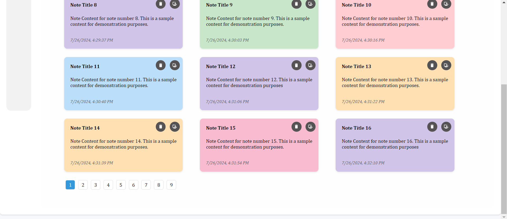

# Documentation for Note Taking Application

## Command to run project in local  

### Install project dependencies
1. ```npm i``` 

### Start project for development
2. ```npm run dev```

## Access project using below url
3. http://localhost:5174/

## Build project for deployment
4. ```npm run build```

## Access project using Apache server in Docker
5. ```docker-compose -f docker-compose-apache.yml up```


## Note Taking Application Overview

### Objective
    Develop a simplified web application for taking notes that utilizes local storage for data persistence. This application will demonstrate front-end development skills including CRUD operations, pagination, and a responsive design.

### Project Overview
    The "Simple Note Taking App" will allow users to:
    
   
### Create new notes.View all notes with pagination (10 notes per page). View all notes with pagination (10 notes per page). View notes with their respective timestamps. 

## Pagination :




## ADD :

### Add new Notes

<p>Add a new Note. Clicked left side button open add new list from</p>


<p>List note is new</p>


<p>After adding new note and Show</p>


## SEARCH :

### Search through notes.

<p>Search Title Number 3 </p>


## UPDATE :

### Before updating notes 10


 

### updating  Title 
 
 
### After updating Title


## DELETE :

### Before Deleting notes


### After Deleting Note Title 5 and Note Title 6


### This is a simple Note Taking App that allows the user to add notes, edit them, delete them, and search through them by title and content. Also, when deleting, the program is written to delete notes by their ID